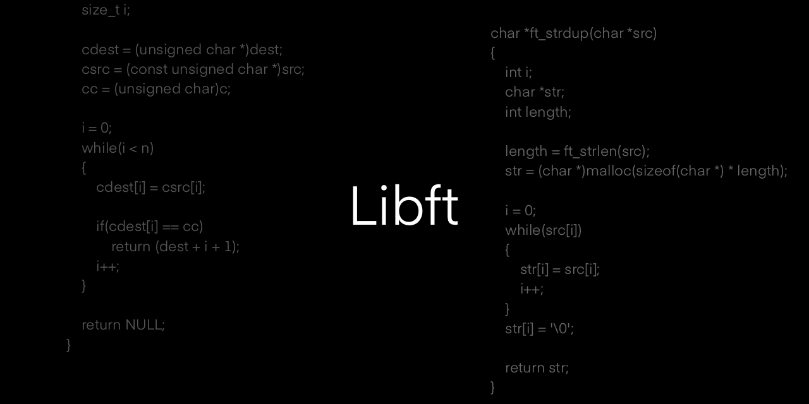

# libft
The libft - rewrited C standard library for own projects.

* Documentation [here](/docs/README.md).

* Tests [here](/tests/README.md).





## Total list of functions

```c
01. int ft_isalpha(int c);

02. int ft_isdigit(int c);

03. int ft_isalnum(int c);

04. int ft_isascii(int c);

05. int ft_isprint(int c);

06. int ft_toupper(int c);

07. int ft_tolower(int c);

08. int ft_isupper(int c);

09. int ft_islower(int c);

10. double ft_inf(void);

11. double ft_log(double x);

12. double ft_pow(double x, double y);

13. double ft_exp(double x);

14. double ft_sqrt(double x);

15. unsigned long ft_factorial(unsigned int n);

16. unsigned long ft_pfactorial(unsigned int n, unsigned int m);

17. unsigned long ft_permutations(unsigned int n);

18. unsigned long ft_variations(unsigned int m, unsigned int n);

19. unsigned long ft_variations_r(unsigned int n, unsigned int m);

20. unsigned long ft_combinations(unsigned int m, unsigned int n);

21. unsigned long ft_combinations_r(unsigned int m, unsigned int n);

22. void *ft_memset(void *s, int c, size_t n);

23. void ft_bzero(void *s, size_t n);

24. void *ft_memcpy(void *dest, const void *src, size_t n);

25. void *ft_memccpy(void *dest, const void *src, int c, size_t n);

26. void *ft_memmove(void *dest, const void *src, size_t n);

27. void *ft_memchr(const void *s, int c, size_t n);

28. int ft_memcmp(const void *s1, const void *s2, size_t n);

29. void ft_putchar(char c);

30. void ft_putstr(char *str);

31. void ft_puts(char *str);

32. void ft_putchar_fd(char c, int fd);

33. void ft_putstr_fd(char *s, int fd);

34. void ft_putendl_fd(char *s, int fd);

35. void ft_putnbr_fd(int n, int fd);

36. int ft_atoi(char *str);

37. int *ft_range(int min, int max);

38. void *ft_calloc(size_t nmemb, size_t size);

39. int ft_strlen(const char *str);

40. size_t ft_strlcpy(char *dest, const char *src, size_t size);

41. size_t ft_strlcat(char *dest, const char *src, size_t size);

42. char *ft_strchr(const char *s, int c);

43. char *ft_strrchr(const char *s, int c);

44. char *ft_strnstr(const char *big, const char *little, size_t len);

45. int ft_strncmp(char *s1, char *s2, size_t n);

46. char **ft_split(char *str, char *charset);

47. char *ft_strdup(const char *src);

48. char *ft_strjoin(int size, char **strs, char *sep);

49. char *ft_substr(char const *s, unsigned int start, size_t len);

50. char *ft_strtrim(char const *s1, char const *set);

51. char *ft_itoa(int n);

52. char *ft_strmapi(char const *s, int (*f)(int));

53. int ft_printf(const char *format, ...);
```
